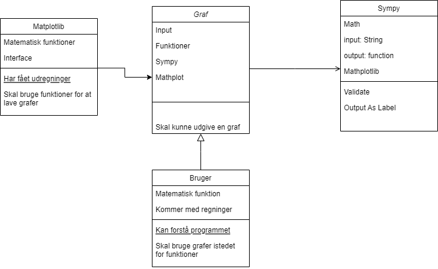
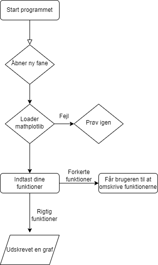
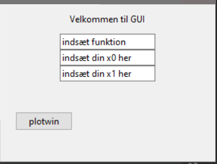
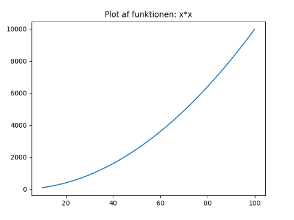

# Projekt-infrastrukturering

Dette er vores projekt opgave hvor vi som har lavet et program som kan bruge matematiske udregninger til at vise et par grafer.

##Vores program er generelt baseret på at vise en graf ud fra matematiske udregninger.
Den starter på at vise et vindue med en x0 og en x1 box, hvor man skal instaste sine udregninger, derefter når man er klar trykker man på "plotwin"
og derfra burde så give dig dine grafer.

Vores [GUI](GUI.PNG) i starten som vi har snakket og diskuteret om ser sådan her ud.

Dette er vores [UML](uml.png) som reprensetere det som vores program skulle kunne gøre.

Det vi viser at matplotlib er connected med vores graf som skal kunne udgive en til brugeren i "return." Sympy viser og bruger matplotlib til at kunne vise programmet grafen.

I forhold til vores program har vi et flowchart som viser en omgang på hvordan programmet virker.
Det viser at programmet starter som den burde, til hvor den åbner et nyt vindue med valgmuligheder.

Dette nye vindue giver muligheden for at skrive dine funktioner ind, sammen med dine x punkter. Når man så skriver sine funktioner rigtig, så burde den give dig en graf som udskrevet, og når den så gør det kan vi se at det virker rigtigt.

I forhold til hvis man skriver det forkert, så er der ikke rigtig lige nu en mulighed for at se om der er en fejl, men det viser i programmet at det opstår et fejl hvis man skriver en forkert funktion.

Her er [flowcharten](codechart.png) som repræssentere hvordan vores kode fungerer fra python synspunkt. 