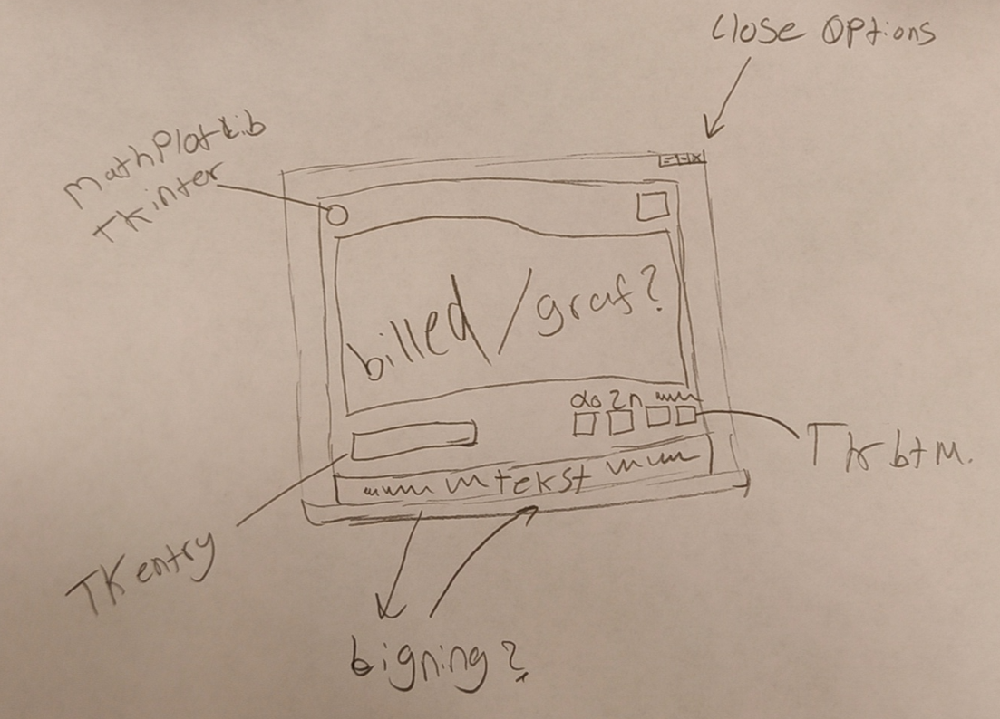

# Projekt-infrastrukturering

Dette er vores projekt hvor vi vil vise et par grafer

##Vores program er generelt baseret på at vise en graf ud fra matematiske udregninger.
Den starter på at vise et vindue med en x0 og en x1 box, hvor man skal instaste sine udregninger, derefter når man er klar trykker man på "plotwin"
og derfra burde så give dig dine grafer.

Vores [GUI](GUI.PNG) i starten som vi har snakket og diskuteret om ser sådan her ud.

Dette er vores [UML](uml.png) som reprensetere det som vores program skulle kunne gøre.

Det vi viser at matplotlib er connected med vores graf som skal kunne udgive en til brugeren i "return." Sympy viser og bruger matplotlib til at kunne vise programmet grafen.
